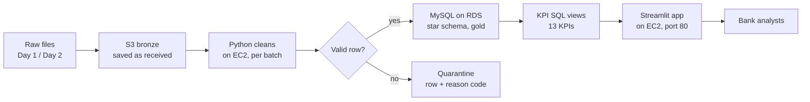

# RetailBank Pipeline — Architecture

Team SkyForge · HCLTech AI-Cloud Data Engineering Hackathon · 6 Oct 2026

## What we are building

A pipeline on AWS that takes the bank's messy raw files, cleans them, stores them in a clean database, and shows 13 KPIs on a dashboard.

- **Input:** 4 raw files on Day 1 (customers, branches, products, transactions) and 4 more on Day 2 (new records, updates, corrections).
- **Output:** clean tables, a list of rejected records with reasons, and a Streamlit dashboard with the KPIs.
- **Key promise:** running Day 2 updates the data without duplicates, and running any batch twice changes nothing.

## Architecture flow

Raw files land in S3, Python on EC2 cleans each row, valid rows go to MySQL and bad rows go to quarantine, and the dashboard shows KPIs from MySQL.

Follow the arrows: raw files → S3 → cleaning → a check on every row. Valid rows go into MySQL, then KPI queries, then the dashboard. Rows that fail go to the quarantine table with a reason. CloudWatch logs every step.

## The four layers

| Layer | Where it lives | What happens |
| --- | --- | --- |
| **Bronze** (raw) | S3 bucket | Files are saved exactly as received, with a log of file name, row count and batch (day1 / day2) |
| **Silver** (clean) | Python on EC2 | Fix formats (dates, amounts, KYC codes), remove duplicates, check IDs exist. Bad rows go to a quarantine table with a reason |
| **Gold** (curated) | MySQL on RDS | Star schema: 3 dimension tables (customer, product, branch) + 1 transaction fact table |
| **KPI** | SQL views + Streamlit | 13 KPI queries; the dashboard reads them and shows the results |

## Why these AWS services

We use only the services the pipeline needs; the data is small (megabytes), so we kept it simple.

| Service | Its job | Why not the alternative |
| --- | --- | --- |
| **S3** | Stores the raw files (bronze) | A database can't keep a file exactly as received, especially a broken JSON |
| **EC2** | Runs the Python cleaning code and the dashboard | A dashboard must run all the time; Lambda is for short, event-triggered jobs |
| **RDS MySQL** | Stores clean tables and runs KPI SQL | KPIs need JOINs, ranking and window functions; DynamoDB has none of these |
| **VPC + security group** | Keeps the database private | Only our EC2 can reach the database; it is never on the internet |
| **IAM role** | Gives EC2 permission to use S3 and secrets | No passwords or access keys in our code |
| **CloudWatch** | Collects logs and alerts on errors | Tells us a run failed without logging into the server |

**Not used, on purpose:** Glue and Redshift. They are built for gigabytes to terabytes; on our small files they only add start-up time and cost. We would switch to them if the data grew.

## Bad data, Day 2 and security

**Bad data.**

- Fixable problems are fixed: date formats, "₹1,200" amounts, "verified" vs "VERIFIED".
- Unfixable rows go to a **quarantine table with a reason** (for example, a transaction for an account that doesn't exist). Nothing is silently dropped.
- A **data-quality scorecard** shows, per file: rows received, passed, rejected, and the top reasons.

**Day 2 changes.**

- **Changed customer** (e.g. KYC Pending → Verified): we keep the old row and add a new one, so history is saved (SCD Type 2).
- **Corrected transaction** (same ID, new amount): we update the existing row, so totals are never counted twice.
- **Re-running a batch** finds nothing new and changes nothing.

**Security.**

- Database is in a private network; only our server can reach it.
- Passwords are stored in AWS Parameter Store, not in code or GitHub.
- The server uses an IAM role with only the permissions it needs.

## One-minute explanation

"The bank's raw files first land in S3 exactly as received; that's our bronze layer. A Python program on EC2 cleans them: it fixes formats, removes duplicates, and sends rows it can't fix to a quarantine table with a reason. The clean data goes into MySQL on RDS as a star schema, three dimensions and one transaction fact table. Our 13 KPIs are SQL queries on those tables, and a Streamlit dashboard shows them. On Day 2, changed customers get a new history row and corrected transactions update the existing row, so nothing is double-counted. The database is private, passwords are in Parameter Store, and errors are logged in CloudWatch. We skipped Glue and Redshift because our data is small; we'd use them at larger scale."
